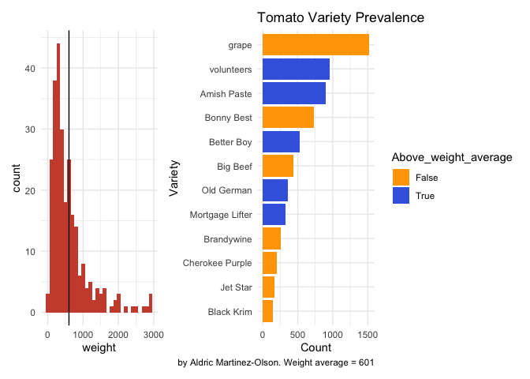

```r
library(tidyverse)     # for data cleaning and plotting
library(gardenR)       # for Lisa's garden data
library(lubridate)     # for date manipulation
library(openintro)     # for the abbr2state() function
library(palmerpenguins)# for Palmer penguin data
library(maps)          # for map data
library(ggmap)         # for mapping points on maps
library(gplots)        # for col2hex() function
library(RColorBrewer)  # for color palettes
library(sf)            # for working with spatial data
library(leaflet)       # for highly customizable mapping
library(ggthemes)      # for more themes (including theme_map())
library(plotly)        # for the ggplotly() - basic interactivity
library(gganimate)     # for adding animation layers to ggplots
library(gifski)        # for creating the gif (don't need to load this library every time,but need it installed)
library(transformr)    # for "tweening" (gganimate)
library(shiny)         # for creating interactive apps
library(patchwork)     # for nicely combining ggplot2 graphs  
library(gt)            # for creating nice tables
library(rvest)         # for scraping data
library(robotstxt)     # for checking if you can scrape data
library(readr)
theme_set(theme_minimal())
```


```r
# Lisa's garden data
data("garden_harvest")

#COVID-19 data from the New York Times
covid19 <- read_csv("https://raw.githubusercontent.com/nytimes/covid-19-data/master/us-states.csv")
```

## Put your homework on GitHub!

Go [here](https://github.com/llendway/github_for_collaboration/blob/master/github_for_collaboration.md) or to previous homework to remind yourself how to get set up. 

Once your repository is created, you should always open your **project** rather than just opening an .Rmd file. You can do that by either clicking on the .Rproj file in your repository folder on your computer. Or, by going to the upper right hand corner in R Studio and clicking the arrow next to where it says Project: (None). You should see your project come up in that list if you've used it recently. You could also go to File --> Open Project and navigate to your .Rproj file. 

## Instructions

* Put your name at the top of the document. 

* **For ALL graphs, you should include appropriate labels.** 

* Feel free to change the default theme, which I currently have set to `theme_minimal()`. 

* Use good coding practice. Read the short sections on good code with [pipes](https://style.tidyverse.org/pipes.html) and [ggplot2](https://style.tidyverse.org/ggplot2.html). **This is part of your grade!**

* **NEW!!** With animated graphs, add `eval=FALSE` to the code chunk that creates the animation and saves it using `anim_save()`. Add another code chunk to reread the gif back into the file. See the [tutorial](https://animation-and-interactivity-in-r.netlify.app/) for help. 

* When you are finished with ALL the exercises, uncomment the options at the top so your document looks nicer. Don't do it before then, or else you might miss some important warnings and messages.

## Your first `shiny` app 

  1. This app will also use the COVID data. Make sure you load that data and all the libraries you need in the `app.R` file you create. Below, you will post a link to the app that you publish on shinyapps.io. You will create an app to compare states' cumulative number of COVID cases over time. The x-axis will be number of days since 20+ cases and the y-axis will be cumulative cases on the log scale (`scale_y_log10()`). We use number of days since 20+ cases on the x-axis so we can make better comparisons of the curve trajectories. You will have an input box where the user can choose which states to compare (`selectInput()`) and have a submit button to click once the user has chosen all states they're interested in comparing. The graph should display a different line for each state, with labels either on the graph or in a legend. Color can be used if needed. 

https://aldricmo.shinyapps.io/CovidApp/

## Warm-up exercises from tutorial

  2. Read in the fake garden harvest data. Find the data [here](https://github.com/llendway/scraping_etc/blob/main/2020_harvest.csv) and click on the `Raw` button to get a direct link to the data. 
  

```r
fake_garden_harvest <- read_csv("https://raw.githubusercontent.com/llendway/scraping_etc/main/2020_harvest.csv")
```
  
  3. Read in this [data](https://www.kaggle.com/heeraldedhia/groceries-dataset) from the kaggle website. You will need to download the data first. Save it to your project/repo folder. Do some quick checks of the data to assure it has been read in appropriately.
  

```r
Groceries_dataset <- read_csv("Groceries_dataset.csv", 
    col_types = cols(Member_number = col_number(), 
        Date = col_date(format = "%d-%m-%Y")))
```

  4. CHALLENGE(not graded): Write code to replicate the table shown below (open the .html file to see it) created from the `garden_harvest` data as best as you can. When you get to coloring the cells, I used the following line of code for the `colors` argument:
  

```r
colors = scales::col_numeric(
      palette = paletteer::paletteer_d(
        palette = "RColorBrewer::YlGn"
      ) %>% as.character()
```

  5. Create a table using `gt` with data from your project or from the `garden_harvest` data if your project data aren't ready.
  

```r
library(gt)

garden_harvest %>%
  filter(vegetable == "beets", 
         variety != "leaves") %>%
  select(-vegetable, -units) %>%
  group_by(variety) %>% 
  mutate(cumulative_weight = cumsum(weight)) %>% 
  gt(
     groupname_col = "variety") %>% 
  tab_header(title = "Vegetable Harvests",
             subtitle = "Grams") %>% 
  tab_options(column_labels.background.color = "green")
```

```{=html}
<style>html {
  font-family: -apple-system, BlinkMacSystemFont, 'Segoe UI', Roboto, Oxygen, Ubuntu, Cantarell, 'Helvetica Neue', 'Fira Sans', 'Droid Sans', Arial, sans-serif;
}

#ilzpxxcsfc .gt_table {
  display: table;
  border-collapse: collapse;
  margin-left: auto;
  margin-right: auto;
  color: #333333;
  font-size: 16px;
  font-weight: normal;
  font-style: normal;
  background-color: #FFFFFF;
  width: auto;
  border-top-style: solid;
  border-top-width: 2px;
  border-top-color: #A8A8A8;
  border-right-style: none;
  border-right-width: 2px;
  border-right-color: #D3D3D3;
  border-bottom-style: solid;
  border-bottom-width: 2px;
  border-bottom-color: #A8A8A8;
  border-left-style: none;
  border-left-width: 2px;
  border-left-color: #D3D3D3;
}

#ilzpxxcsfc .gt_heading {
  background-color: #FFFFFF;
  text-align: center;
  border-bottom-color: #FFFFFF;
  border-left-style: none;
  border-left-width: 1px;
  border-left-color: #D3D3D3;
  border-right-style: none;
  border-right-width: 1px;
  border-right-color: #D3D3D3;
}

#ilzpxxcsfc .gt_title {
  color: #333333;
  font-size: 125%;
  font-weight: initial;
  padding-top: 4px;
  padding-bottom: 4px;
  border-bottom-color: #FFFFFF;
  border-bottom-width: 0;
}

#ilzpxxcsfc .gt_subtitle {
  color: #333333;
  font-size: 85%;
  font-weight: initial;
  padding-top: 0;
  padding-bottom: 4px;
  border-top-color: #FFFFFF;
  border-top-width: 0;
}

#ilzpxxcsfc .gt_bottom_border {
  border-bottom-style: solid;
  border-bottom-width: 2px;
  border-bottom-color: #D3D3D3;
}

#ilzpxxcsfc .gt_col_headings {
  border-top-style: solid;
  border-top-width: 2px;
  border-top-color: #D3D3D3;
  border-bottom-style: solid;
  border-bottom-width: 2px;
  border-bottom-color: #D3D3D3;
  border-left-style: none;
  border-left-width: 1px;
  border-left-color: #D3D3D3;
  border-right-style: none;
  border-right-width: 1px;
  border-right-color: #D3D3D3;
}

#ilzpxxcsfc .gt_col_heading {
  color: #FFFFFF;
  background-color: green;
  font-size: 100%;
  font-weight: normal;
  text-transform: inherit;
  border-left-style: none;
  border-left-width: 1px;
  border-left-color: #D3D3D3;
  border-right-style: none;
  border-right-width: 1px;
  border-right-color: #D3D3D3;
  vertical-align: bottom;
  padding-top: 5px;
  padding-bottom: 6px;
  padding-left: 5px;
  padding-right: 5px;
  overflow-x: hidden;
}

#ilzpxxcsfc .gt_column_spanner_outer {
  color: #FFFFFF;
  background-color: green;
  font-size: 100%;
  font-weight: normal;
  text-transform: inherit;
  padding-top: 0;
  padding-bottom: 0;
  padding-left: 4px;
  padding-right: 4px;
}

#ilzpxxcsfc .gt_column_spanner_outer:first-child {
  padding-left: 0;
}

#ilzpxxcsfc .gt_column_spanner_outer:last-child {
  padding-right: 0;
}

#ilzpxxcsfc .gt_column_spanner {
  border-bottom-style: solid;
  border-bottom-width: 2px;
  border-bottom-color: #D3D3D3;
  vertical-align: bottom;
  padding-top: 5px;
  padding-bottom: 6px;
  overflow-x: hidden;
  display: inline-block;
  width: 100%;
}

#ilzpxxcsfc .gt_group_heading {
  padding: 8px;
  color: #333333;
  background-color: #FFFFFF;
  font-size: 100%;
  font-weight: initial;
  text-transform: inherit;
  border-top-style: solid;
  border-top-width: 2px;
  border-top-color: #D3D3D3;
  border-bottom-style: solid;
  border-bottom-width: 2px;
  border-bottom-color: #D3D3D3;
  border-left-style: none;
  border-left-width: 1px;
  border-left-color: #D3D3D3;
  border-right-style: none;
  border-right-width: 1px;
  border-right-color: #D3D3D3;
  vertical-align: middle;
}

#ilzpxxcsfc .gt_empty_group_heading {
  padding: 0.5px;
  color: #333333;
  background-color: #FFFFFF;
  font-size: 100%;
  font-weight: initial;
  border-top-style: solid;
  border-top-width: 2px;
  border-top-color: #D3D3D3;
  border-bottom-style: solid;
  border-bottom-width: 2px;
  border-bottom-color: #D3D3D3;
  vertical-align: middle;
}

#ilzpxxcsfc .gt_from_md > :first-child {
  margin-top: 0;
}

#ilzpxxcsfc .gt_from_md > :last-child {
  margin-bottom: 0;
}

#ilzpxxcsfc .gt_row {
  padding-top: 8px;
  padding-bottom: 8px;
  padding-left: 5px;
  padding-right: 5px;
  margin: 10px;
  border-top-style: solid;
  border-top-width: 1px;
  border-top-color: #D3D3D3;
  border-left-style: none;
  border-left-width: 1px;
  border-left-color: #D3D3D3;
  border-right-style: none;
  border-right-width: 1px;
  border-right-color: #D3D3D3;
  vertical-align: middle;
  overflow-x: hidden;
}

#ilzpxxcsfc .gt_stub {
  color: #333333;
  background-color: #FFFFFF;
  font-size: 100%;
  font-weight: initial;
  text-transform: inherit;
  border-right-style: solid;
  border-right-width: 2px;
  border-right-color: #D3D3D3;
  padding-left: 12px;
}

#ilzpxxcsfc .gt_summary_row {
  color: #333333;
  background-color: #FFFFFF;
  text-transform: inherit;
  padding-top: 8px;
  padding-bottom: 8px;
  padding-left: 5px;
  padding-right: 5px;
}

#ilzpxxcsfc .gt_first_summary_row {
  padding-top: 8px;
  padding-bottom: 8px;
  padding-left: 5px;
  padding-right: 5px;
  border-top-style: solid;
  border-top-width: 2px;
  border-top-color: #D3D3D3;
}

#ilzpxxcsfc .gt_grand_summary_row {
  color: #333333;
  background-color: #FFFFFF;
  text-transform: inherit;
  padding-top: 8px;
  padding-bottom: 8px;
  padding-left: 5px;
  padding-right: 5px;
}

#ilzpxxcsfc .gt_first_grand_summary_row {
  padding-top: 8px;
  padding-bottom: 8px;
  padding-left: 5px;
  padding-right: 5px;
  border-top-style: double;
  border-top-width: 6px;
  border-top-color: #D3D3D3;
}

#ilzpxxcsfc .gt_striped {
  background-color: rgba(128, 128, 128, 0.05);
}

#ilzpxxcsfc .gt_table_body {
  border-top-style: solid;
  border-top-width: 2px;
  border-top-color: #D3D3D3;
  border-bottom-style: solid;
  border-bottom-width: 2px;
  border-bottom-color: #D3D3D3;
}

#ilzpxxcsfc .gt_footnotes {
  color: #333333;
  background-color: #FFFFFF;
  border-bottom-style: none;
  border-bottom-width: 2px;
  border-bottom-color: #D3D3D3;
  border-left-style: none;
  border-left-width: 2px;
  border-left-color: #D3D3D3;
  border-right-style: none;
  border-right-width: 2px;
  border-right-color: #D3D3D3;
}

#ilzpxxcsfc .gt_footnote {
  margin: 0px;
  font-size: 90%;
  padding: 4px;
}

#ilzpxxcsfc .gt_sourcenotes {
  color: #333333;
  background-color: #FFFFFF;
  border-bottom-style: none;
  border-bottom-width: 2px;
  border-bottom-color: #D3D3D3;
  border-left-style: none;
  border-left-width: 2px;
  border-left-color: #D3D3D3;
  border-right-style: none;
  border-right-width: 2px;
  border-right-color: #D3D3D3;
}

#ilzpxxcsfc .gt_sourcenote {
  font-size: 90%;
  padding: 4px;
}

#ilzpxxcsfc .gt_left {
  text-align: left;
}

#ilzpxxcsfc .gt_center {
  text-align: center;
}

#ilzpxxcsfc .gt_right {
  text-align: right;
  font-variant-numeric: tabular-nums;
}

#ilzpxxcsfc .gt_font_normal {
  font-weight: normal;
}

#ilzpxxcsfc .gt_font_bold {
  font-weight: bold;
}

#ilzpxxcsfc .gt_font_italic {
  font-style: italic;
}

#ilzpxxcsfc .gt_super {
  font-size: 65%;
}

#ilzpxxcsfc .gt_footnote_marks {
  font-style: italic;
  font-size: 65%;
}
</style>
<div id="ilzpxxcsfc" style="overflow-x:auto;overflow-y:auto;width:auto;height:auto;"><table class="gt_table">
  <thead class="gt_header">
    <tr>
      <th colspan="3" class="gt_heading gt_title gt_font_normal" style>Vegetable Harvests</th>
    </tr>
    <tr>
      <th colspan="3" class="gt_heading gt_subtitle gt_font_normal gt_bottom_border" style>Grams</th>
    </tr>
  </thead>
  <thead class="gt_col_headings">
    <tr>
      <th class="gt_col_heading gt_columns_bottom_border gt_left" rowspan="1" colspan="1">date</th>
      <th class="gt_col_heading gt_columns_bottom_border gt_right" rowspan="1" colspan="1">weight</th>
      <th class="gt_col_heading gt_columns_bottom_border gt_right" rowspan="1" colspan="1">cumulative_weight</th>
    </tr>
  </thead>
  <tbody class="gt_table_body">
    <tr class="gt_group_heading_row">
      <td colspan="3" class="gt_group_heading">Gourmet Golden</td>
    </tr>
    <tr>
      <td class="gt_row gt_left">2020-07-07</td>
      <td class="gt_row gt_right">62</td>
      <td class="gt_row gt_right">62</td>
    </tr>
    <tr>
      <td class="gt_row gt_left">2020-07-08</td>
      <td class="gt_row gt_right">83</td>
      <td class="gt_row gt_right">145</td>
    </tr>
    <tr>
      <td class="gt_row gt_left">2020-07-20</td>
      <td class="gt_row gt_right">107</td>
      <td class="gt_row gt_right">252</td>
    </tr>
    <tr>
      <td class="gt_row gt_left">2020-07-27</td>
      <td class="gt_row gt_right">149</td>
      <td class="gt_row gt_right">401</td>
    </tr>
    <tr>
      <td class="gt_row gt_left">2020-08-13</td>
      <td class="gt_row gt_right">308</td>
      <td class="gt_row gt_right">709</td>
    </tr>
    <tr>
      <td class="gt_row gt_left">2020-08-13</td>
      <td class="gt_row gt_right">2476</td>
      <td class="gt_row gt_right">3185</td>
    </tr>
    <tr class="gt_group_heading_row">
      <td colspan="3" class="gt_group_heading">Sweet Merlin</td>
    </tr>
    <tr>
      <td class="gt_row gt_left">2020-07-07</td>
      <td class="gt_row gt_right">10</td>
      <td class="gt_row gt_right">10</td>
    </tr>
    <tr>
      <td class="gt_row gt_left">2020-07-09</td>
      <td class="gt_row gt_right">69</td>
      <td class="gt_row gt_right">79</td>
    </tr>
    <tr>
      <td class="gt_row gt_left">2020-07-12</td>
      <td class="gt_row gt_right">89</td>
      <td class="gt_row gt_right">168</td>
    </tr>
    <tr>
      <td class="gt_row gt_left">2020-07-18</td>
      <td class="gt_row gt_right">172</td>
      <td class="gt_row gt_right">340</td>
    </tr>
    <tr>
      <td class="gt_row gt_left">2020-07-27</td>
      <td class="gt_row gt_right">49</td>
      <td class="gt_row gt_right">389</td>
    </tr>
    <tr>
      <td class="gt_row gt_left">2020-07-30</td>
      <td class="gt_row gt_right">101</td>
      <td class="gt_row gt_right">490</td>
    </tr>
    <tr>
      <td class="gt_row gt_left">2020-08-13</td>
      <td class="gt_row gt_right">198</td>
      <td class="gt_row gt_right">688</td>
    </tr>
    <tr>
      <td class="gt_row gt_left">2020-08-13</td>
      <td class="gt_row gt_right">2209</td>
      <td class="gt_row gt_right">2897</td>
    </tr>
  </tbody>
  
  
</table></div>
```
  
  6. Use `patchwork` operators and functions to combine at least two graphs using your project data or `garden_harvest` data if your project data aren't read. (This looks much better when made fullscreen)
  

```r
tomatoesonly <-
  garden_harvest %>% 
    filter(vegetable == "tomatoes")
  
graphA <- tomatoesonly %>% 
  ggplot(aes(x = weight)) +
  geom_histogram(fill = "tomato3") +
  geom_vline(xintercept = 601.6)

  garden_harvest %>% 
    filter(vegetable == "tomatoes") %>%
    group_by(variety) %>% 
    mutate(mean_weight = mean(weight))
```

<div data-pagedtable="false">
  <script data-pagedtable-source type="application/json">
{"columns":[{"label":["vegetable"],"name":[1],"type":["chr"],"align":["left"]},{"label":["variety"],"name":[2],"type":["chr"],"align":["left"]},{"label":["date"],"name":[3],"type":["date"],"align":["right"]},{"label":["weight"],"name":[4],"type":["dbl"],"align":["right"]},{"label":["units"],"name":[5],"type":["chr"],"align":["left"]},{"label":["mean_weight"],"name":[6],"type":["dbl"],"align":["right"]}],"data":[{"1":"tomatoes","2":"grape","3":"2020-07-11","4":"24","5":"grams","6":"376.7692"},{"1":"tomatoes","2":"grape","3":"2020-07-21","4":"86","5":"grams","6":"376.7692"},{"1":"tomatoes","2":"Big Beef","3":"2020-07-21","4":"137","5":"grams","6":"539.8571"},{"1":"tomatoes","2":"Bonny Best","3":"2020-07-21","4":"339","5":"grams","6":"418.7037"},{"1":"tomatoes","2":"grape","3":"2020-07-24","4":"31","5":"grams","6":"376.7692"},{"1":"tomatoes","2":"Bonny Best","3":"2020-07-24","4":"140","5":"grams","6":"418.7037"},{"1":"tomatoes","2":"Cherokee Purple","3":"2020-07-24","4":"247","5":"grams","6":"509.0714"},{"1":"tomatoes","2":"Better Boy","3":"2020-07-24","4":"220","5":"grams","6":"670.6957"},{"1":"tomatoes","2":"Amish Paste","3":"2020-07-25","4":"463","5":"grams","6":"992.9667"},{"1":"tomatoes","2":"grape","3":"2020-07-25","4":"106","5":"grams","6":"376.7692"},{"1":"tomatoes","2":"Bonny Best","3":"2020-07-26","4":"148","5":"grams","6":"418.7037"},{"1":"tomatoes","2":"Mortgage Lifter","3":"2020-07-27","4":"801","5":"grams","6":"663.3889"},{"1":"tomatoes","2":"Old German","3":"2020-07-28","4":"611","5":"grams","6":"637.8421"},{"1":"tomatoes","2":"Big Beef","3":"2020-07-28","4":"203","5":"grams","6":"539.8571"},{"1":"tomatoes","2":"Better Boy","3":"2020-07-28","4":"312","5":"grams","6":"670.6957"},{"1":"tomatoes","2":"Jet Star","3":"2020-07-28","4":"315","5":"grams","6":"524.2308"},{"1":"tomatoes","2":"grape","3":"2020-07-28","4":"131","5":"grams","6":"376.7692"},{"1":"tomatoes","2":"Bonny Best","3":"2020-07-29","4":"153","5":"grams","6":"418.7037"},{"1":"tomatoes","2":"Better Boy","3":"2020-07-29","4":"442","5":"grams","6":"670.6957"},{"1":"tomatoes","2":"Cherokee Purple","3":"2020-07-29","4":"240","5":"grams","6":"509.0714"},{"1":"tomatoes","2":"Amish Paste","3":"2020-07-29","4":"209","5":"grams","6":"992.9667"},{"1":"tomatoes","2":"grape","3":"2020-07-29","4":"40","5":"grams","6":"376.7692"},{"1":"tomatoes","2":"grape","3":"2020-07-30","4":"91","5":"grams","6":"376.7692"},{"1":"tomatoes","2":"Cherokee Purple","3":"2020-07-31","4":"307","5":"grams","6":"509.0714"},{"1":"tomatoes","2":"Amish Paste","3":"2020-07-31","4":"197","5":"grams","6":"992.9667"},{"1":"tomatoes","2":"Old German","3":"2020-07-31","4":"633","5":"grams","6":"637.8421"},{"1":"tomatoes","2":"Better Boy","3":"2020-07-31","4":"290","5":"grams","6":"670.6957"},{"1":"tomatoes","2":"grape","3":"2020-07-31","4":"100","5":"grams","6":"376.7692"},{"1":"tomatoes","2":"Bonny Best","3":"2020-08-01","4":"435","5":"grams","6":"418.7037"},{"1":"tomatoes","2":"Brandywine","3":"2020-08-01","4":"320","5":"grams","6":"443.5625"},{"1":"tomatoes","2":"Cherokee Purple","3":"2020-08-01","4":"619","5":"grams","6":"509.0714"},{"1":"tomatoes","2":"Amish Paste","3":"2020-08-01","4":"97","5":"grams","6":"992.9667"},{"1":"tomatoes","2":"Black Krim","3":"2020-08-01","4":"436","5":"grams","6":"597.5000"},{"1":"tomatoes","2":"grape","3":"2020-08-01","4":"168","5":"grams","6":"376.7692"},{"1":"tomatoes","2":"Amish Paste","3":"2020-08-02","4":"509","5":"grams","6":"992.9667"},{"1":"tomatoes","2":"Black Krim","3":"2020-08-02","4":"857","5":"grams","6":"597.5000"},{"1":"tomatoes","2":"Old German","3":"2020-08-02","4":"336","5":"grams","6":"637.8421"},{"1":"tomatoes","2":"Bonny Best","3":"2020-08-02","4":"156","5":"grams","6":"418.7037"},{"1":"tomatoes","2":"Better Boy","3":"2020-08-02","4":"211","5":"grams","6":"670.6957"},{"1":"tomatoes","2":"grape","3":"2020-08-02","4":"102","5":"grams","6":"376.7692"},{"1":"tomatoes","2":"Better Boy","3":"2020-08-03","4":"308","5":"grams","6":"670.6957"},{"1":"tomatoes","2":"Bonny Best","3":"2020-08-04","4":"387","5":"grams","6":"418.7037"},{"1":"tomatoes","2":"Brandywine","3":"2020-08-04","4":"231","5":"grams","6":"443.5625"},{"1":"tomatoes","2":"volunteers","3":"2020-08-04","4":"73","5":"grams","6":"755.1935"},{"1":"tomatoes","2":"Mortgage Lifter","3":"2020-08-04","4":"339","5":"grams","6":"663.3889"},{"1":"tomatoes","2":"grape","3":"2020-08-04","4":"118","5":"grams","6":"376.7692"},{"1":"tomatoes","2":"Bonny Best","3":"2020-08-05","4":"563","5":"grams","6":"418.7037"},{"1":"tomatoes","2":"Brandywine","3":"2020-08-05","4":"290","5":"grams","6":"443.5625"},{"1":"tomatoes","2":"Mortgage Lifter","3":"2020-08-05","4":"781","5":"grams","6":"663.3889"},{"1":"tomatoes","2":"Big Beef","3":"2020-08-05","4":"223","5":"grams","6":"539.8571"},{"1":"tomatoes","2":"Amish Paste","3":"2020-08-05","4":"382","5":"grams","6":"992.9667"},{"1":"tomatoes","2":"grape","3":"2020-08-05","4":"217","5":"grams","6":"376.7692"},{"1":"tomatoes","2":"volunteers","3":"2020-08-05","4":"67","5":"grams","6":"755.1935"},{"1":"tomatoes","2":"Black Krim","3":"2020-08-06","4":"393","5":"grams","6":"597.5000"},{"1":"tomatoes","2":"Big Beef","3":"2020-08-06","4":"307","5":"grams","6":"539.8571"},{"1":"tomatoes","2":"Amish Paste","3":"2020-08-06","4":"175","5":"grams","6":"992.9667"},{"1":"tomatoes","2":"Cherokee Purple","3":"2020-08-06","4":"303","5":"grams","6":"509.0714"},{"1":"tomatoes","2":"Bonny Best","3":"2020-08-07","4":"359","5":"grams","6":"418.7037"},{"1":"tomatoes","2":"Brandywine","3":"2020-08-07","4":"356","5":"grams","6":"443.5625"},{"1":"tomatoes","2":"Old German","3":"2020-08-07","4":"233","5":"grams","6":"637.8421"},{"1":"tomatoes","2":"Mortgage Lifter","3":"2020-08-07","4":"364","5":"grams","6":"663.3889"},{"1":"tomatoes","2":"Better Boy","3":"2020-08-07","4":"1045","5":"grams","6":"670.6957"},{"1":"tomatoes","2":"Jet Star","3":"2020-08-07","4":"562","5":"grams","6":"524.2308"},{"1":"tomatoes","2":"grape","3":"2020-08-07","4":"292","5":"grams","6":"376.7692"},{"1":"tomatoes","2":"Big Beef","3":"2020-08-08","4":"162","5":"grams","6":"539.8571"},{"1":"tomatoes","2":"grape","3":"2020-08-08","4":"81","5":"grams","6":"376.7692"},{"1":"tomatoes","2":"Bonny Best","3":"2020-08-08","4":"564","5":"grams","6":"418.7037"},{"1":"tomatoes","2":"Jet Star","3":"2020-08-08","4":"184","5":"grams","6":"524.2308"},{"1":"tomatoes","2":"Bonny Best","3":"2020-08-09","4":"179","5":"grams","6":"418.7037"},{"1":"tomatoes","2":"Jet Star","3":"2020-08-09","4":"591","5":"grams","6":"524.2308"},{"1":"tomatoes","2":"Better Boy","3":"2020-08-09","4":"1102","5":"grams","6":"670.6957"},{"1":"tomatoes","2":"Cherokee Purple","3":"2020-08-09","4":"308","5":"grams","6":"509.0714"},{"1":"tomatoes","2":"volunteers","3":"2020-08-09","4":"54","5":"grams","6":"755.1935"},{"1":"tomatoes","2":"grape","3":"2020-08-09","4":"64","5":"grams","6":"376.7692"},{"1":"tomatoes","2":"Cherokee Purple","3":"2020-08-10","4":"216","5":"grams","6":"509.0714"},{"1":"tomatoes","2":"Jet Star","3":"2020-08-10","4":"241","5":"grams","6":"524.2308"},{"1":"tomatoes","2":"grape","3":"2020-08-11","4":"302","5":"grams","6":"376.7692"},{"1":"tomatoes","2":"Bonny Best","3":"2020-08-11","4":"307","5":"grams","6":"418.7037"},{"1":"tomatoes","2":"volunteers","3":"2020-08-11","4":"160","5":"grams","6":"755.1935"},{"1":"tomatoes","2":"Brandywine","3":"2020-08-11","4":"218","5":"grams","6":"443.5625"},{"1":"tomatoes","2":"Cherokee Purple","3":"2020-08-11","4":"802","5":"grams","6":"509.0714"},{"1":"tomatoes","2":"Better Boy","3":"2020-08-11","4":"354","5":"grams","6":"670.6957"},{"1":"tomatoes","2":"Black Krim","3":"2020-08-11","4":"359","5":"grams","6":"597.5000"},{"1":"tomatoes","2":"Amish Paste","3":"2020-08-11","4":"506","5":"grams","6":"992.9667"},{"1":"tomatoes","2":"grape","3":"2020-08-13","4":"421","5":"grams","6":"376.7692"},{"1":"tomatoes","2":"Bonny Best","3":"2020-08-13","4":"332","5":"grams","6":"418.7037"},{"1":"tomatoes","2":"Better Boy","3":"2020-08-13","4":"727","5":"grams","6":"670.6957"},{"1":"tomatoes","2":"Amish Paste","3":"2020-08-13","4":"642","5":"grams","6":"992.9667"},{"1":"tomatoes","2":"Big Beef","3":"2020-08-13","4":"413","5":"grams","6":"539.8571"},{"1":"tomatoes","2":"Bonny Best","3":"2020-08-14","4":"711","5":"grams","6":"418.7037"},{"1":"tomatoes","2":"Old German","3":"2020-08-14","4":"238","5":"grams","6":"637.8421"},{"1":"tomatoes","2":"Amish Paste","3":"2020-08-14","4":"525","5":"grams","6":"992.9667"},{"1":"tomatoes","2":"Jet Star","3":"2020-08-14","4":"181","5":"grams","6":"524.2308"},{"1":"tomatoes","2":"Big Beef","3":"2020-08-14","4":"266","5":"grams","6":"539.8571"},{"1":"tomatoes","2":"volunteers","3":"2020-08-14","4":"490","5":"grams","6":"755.1935"},{"1":"tomatoes","2":"grape","3":"2020-08-14","4":"126","5":"grams","6":"376.7692"},{"1":"tomatoes","2":"grape","3":"2020-08-16","4":"477","5":"grams","6":"376.7692"},{"1":"tomatoes","2":"volunteers","3":"2020-08-16","4":"328","5":"grams","6":"755.1935"},{"1":"tomatoes","2":"Bonny Best","3":"2020-08-16","4":"543","5":"grams","6":"418.7037"},{"1":"tomatoes","2":"Old German","3":"2020-08-16","4":"599","5":"grams","6":"637.8421"},{"1":"tomatoes","2":"Amish Paste","3":"2020-08-16","4":"560","5":"grams","6":"992.9667"},{"1":"tomatoes","2":"Black Krim","3":"2020-08-16","4":"291","5":"grams","6":"597.5000"},{"1":"tomatoes","2":"Better Boy","3":"2020-08-16","4":"238","5":"grams","6":"670.6957"},{"1":"tomatoes","2":"Big Beef","3":"2020-08-16","4":"397","5":"grams","6":"539.8571"},{"1":"tomatoes","2":"Bonny Best","3":"2020-08-17","4":"364","5":"grams","6":"418.7037"},{"1":"tomatoes","2":"Brandywine","3":"2020-08-17","4":"305","5":"grams","6":"443.5625"},{"1":"tomatoes","2":"Amish Paste","3":"2020-08-17","4":"588","5":"grams","6":"992.9667"},{"1":"tomatoes","2":"Better Boy","3":"2020-08-17","4":"764","5":"grams","6":"670.6957"},{"1":"tomatoes","2":"grape","3":"2020-08-17","4":"436","5":"grams","6":"376.7692"},{"1":"tomatoes","2":"volunteers","3":"2020-08-17","4":"306","5":"grams","6":"755.1935"},{"1":"tomatoes","2":"Mortgage Lifter","3":"2020-08-18","4":"608","5":"grams","6":"663.3889"},{"1":"tomatoes","2":"grape","3":"2020-08-18","4":"136","5":"grams","6":"376.7692"},{"1":"tomatoes","2":"volunteers","3":"2020-08-18","4":"148","5":"grams","6":"755.1935"},{"1":"tomatoes","2":"Black Krim","3":"2020-08-18","4":"317","5":"grams","6":"597.5000"},{"1":"tomatoes","2":"Old German","3":"2020-08-18","4":"105","5":"grams","6":"637.8421"},{"1":"tomatoes","2":"Bonny Best","3":"2020-08-18","4":"271","5":"grams","6":"418.7037"},{"1":"tomatoes","2":"Cherokee Purple","3":"2020-08-19","4":"872","5":"grams","6":"509.0714"},{"1":"tomatoes","2":"Black Krim","3":"2020-08-19","4":"579","5":"grams","6":"597.5000"},{"1":"tomatoes","2":"Better Boy","3":"2020-08-19","4":"615","5":"grams","6":"670.6957"},{"1":"tomatoes","2":"Amish Paste","3":"2020-08-19","4":"997","5":"grams","6":"992.9667"},{"1":"tomatoes","2":"Brandywine","3":"2020-08-19","4":"335","5":"grams","6":"443.5625"},{"1":"tomatoes","2":"Big Beef","3":"2020-08-19","4":"264","5":"grams","6":"539.8571"},{"1":"tomatoes","2":"grape","3":"2020-08-19","4":"451","5":"grams","6":"376.7692"},{"1":"tomatoes","2":"volunteers","3":"2020-08-19","4":"306","5":"grams","6":"755.1935"},{"1":"tomatoes","2":"volunteers","3":"2020-08-20","4":"333","5":"grams","6":"755.1935"},{"1":"tomatoes","2":"Brandywine","3":"2020-08-20","4":"483","5":"grams","6":"443.5625"},{"1":"tomatoes","2":"Bonny Best","3":"2020-08-20","4":"632","5":"grams","6":"418.7037"},{"1":"tomatoes","2":"Jet Star","3":"2020-08-20","4":"360","5":"grams","6":"524.2308"},{"1":"tomatoes","2":"Better Boy","3":"2020-08-20","4":"230","5":"grams","6":"670.6957"},{"1":"tomatoes","2":"Big Beef","3":"2020-08-20","4":"344","5":"grams","6":"539.8571"},{"1":"tomatoes","2":"Amish Paste","3":"2020-08-20","4":"1010","5":"grams","6":"992.9667"},{"1":"tomatoes","2":"grape","3":"2020-08-20","4":"493","5":"grams","6":"376.7692"},{"1":"tomatoes","2":"Cherokee Purple","3":"2020-08-21","4":"1601","5":"grams","6":"509.0714"},{"1":"tomatoes","2":"Big Beef","3":"2020-08-21","4":"842","5":"grams","6":"539.8571"},{"1":"tomatoes","2":"Black Krim","3":"2020-08-21","4":"1538","5":"grams","6":"597.5000"},{"1":"tomatoes","2":"Amish Paste","3":"2020-08-21","4":"428","5":"grams","6":"992.9667"},{"1":"tomatoes","2":"Old German","3":"2020-08-21","4":"243","5":"grams","6":"637.8421"},{"1":"tomatoes","2":"Bonny Best","3":"2020-08-21","4":"330","5":"grams","6":"418.7037"},{"1":"tomatoes","2":"grape","3":"2020-08-21","4":"265","5":"grams","6":"376.7692"},{"1":"tomatoes","2":"volunteers","3":"2020-08-21","4":"562","5":"grams","6":"755.1935"},{"1":"tomatoes","2":"Amish Paste","3":"2020-08-23","4":"1542","5":"grams","6":"992.9667"},{"1":"tomatoes","2":"Old German","3":"2020-08-23","4":"801","5":"grams","6":"637.8421"},{"1":"tomatoes","2":"grape","3":"2020-08-23","4":"436","5":"grams","6":"376.7692"},{"1":"tomatoes","2":"Black Krim","3":"2020-08-23","4":"1573","5":"grams","6":"597.5000"},{"1":"tomatoes","2":"Mortgage Lifter","3":"2020-08-23","4":"704","5":"grams","6":"663.3889"},{"1":"tomatoes","2":"Brandywine","3":"2020-08-23","4":"446","5":"grams","6":"443.5625"},{"1":"tomatoes","2":"Bonny Best","3":"2020-08-23","4":"269","5":"grams","6":"418.7037"},{"1":"tomatoes","2":"grape","3":"2020-08-24","4":"75","5":"grams","6":"376.7692"},{"1":"tomatoes","2":"Jet Star","3":"2020-08-25","4":"578","5":"grams","6":"524.2308"},{"1":"tomatoes","2":"Brandywine","3":"2020-08-25","4":"871","5":"grams","6":"443.5625"},{"1":"tomatoes","2":"Old German","3":"2020-08-25","4":"115","5":"grams","6":"637.8421"},{"1":"tomatoes","2":"Bonny Best","3":"2020-08-25","4":"629","5":"grams","6":"418.7037"},{"1":"tomatoes","2":"volunteers","3":"2020-08-25","4":"488","5":"grams","6":"755.1935"},{"1":"tomatoes","2":"grape","3":"2020-08-25","4":"506","5":"grams","6":"376.7692"},{"1":"tomatoes","2":"Amish Paste","3":"2020-08-25","4":"1400","5":"grams","6":"992.9667"},{"1":"tomatoes","2":"Big Beef","3":"2020-08-25","4":"993","5":"grams","6":"539.8571"},{"1":"tomatoes","2":"Mortgage Lifter","3":"2020-08-25","4":"1026","5":"grams","6":"663.3889"},{"1":"tomatoes","2":"Amish Paste","3":"2020-08-26","4":"1886","5":"grams","6":"992.9667"},{"1":"tomatoes","2":"Old German","3":"2020-08-26","4":"666","5":"grams","6":"637.8421"},{"1":"tomatoes","2":"Brandywine","3":"2020-08-26","4":"1042","5":"grams","6":"443.5625"},{"1":"tomatoes","2":"Cherokee Purple","3":"2020-08-26","4":"593","5":"grams","6":"509.0714"},{"1":"tomatoes","2":"Black Krim","3":"2020-08-26","4":"216","5":"grams","6":"597.5000"},{"1":"tomatoes","2":"Better Boy","3":"2020-08-26","4":"309","5":"grams","6":"670.6957"},{"1":"tomatoes","2":"Big Beef","3":"2020-08-26","4":"497","5":"grams","6":"539.8571"},{"1":"tomatoes","2":"volunteers","3":"2020-08-26","4":"261","5":"grams","6":"755.1935"},{"1":"tomatoes","2":"grape","3":"2020-08-26","4":"819","5":"grams","6":"376.7692"},{"1":"tomatoes","2":"grape","3":"2020-08-29","4":"380","5":"grams","6":"376.7692"},{"1":"tomatoes","2":"volunteers","3":"2020-08-29","4":"737","5":"grams","6":"755.1935"},{"1":"tomatoes","2":"Big Beef","3":"2020-08-29","4":"1033","5":"grams","6":"539.8571"},{"1":"tomatoes","2":"Mortgage Lifter","3":"2020-08-29","4":"1097","5":"grams","6":"663.3889"},{"1":"tomatoes","2":"volunteers","3":"2020-08-29","4":"566","5":"grams","6":"755.1935"},{"1":"tomatoes","2":"Old German","3":"2020-08-30","4":"861","5":"grams","6":"637.8421"},{"1":"tomatoes","2":"Brandywine","3":"2020-08-30","4":"460","5":"grams","6":"443.5625"},{"1":"tomatoes","2":"Amish Paste","3":"2020-08-30","4":"2934","5":"grams","6":"992.9667"},{"1":"tomatoes","2":"Cherokee Purple","3":"2020-08-30","4":"599","5":"grams","6":"509.0714"},{"1":"tomatoes","2":"Bonny Best","3":"2020-08-30","4":"155","5":"grams","6":"418.7037"},{"1":"tomatoes","2":"volunteers","3":"2020-08-30","4":"822","5":"grams","6":"755.1935"},{"1":"tomatoes","2":"Mortgage Lifter","3":"2020-08-30","4":"589","5":"grams","6":"663.3889"},{"1":"tomatoes","2":"Better Boy","3":"2020-08-30","4":"393","5":"grams","6":"670.6957"},{"1":"tomatoes","2":"Jet Star","3":"2020-08-30","4":"752","5":"grams","6":"524.2308"},{"1":"tomatoes","2":"grape","3":"2020-08-30","4":"833","5":"grams","6":"376.7692"},{"1":"tomatoes","2":"volunteers","3":"2020-09-01","4":"1953","5":"grams","6":"755.1935"},{"1":"tomatoes","2":"Old German","3":"2020-09-01","4":"805","5":"grams","6":"637.8421"},{"1":"tomatoes","2":"Brandywine","3":"2020-09-01","4":"178","5":"grams","6":"443.5625"},{"1":"tomatoes","2":"Cherokee Purple","3":"2020-09-01","4":"201","5":"grams","6":"509.0714"},{"1":"tomatoes","2":"Amish Paste","3":"2020-09-01","4":"1537","5":"grams","6":"992.9667"},{"1":"tomatoes","2":"Jet Star","3":"2020-09-01","4":"773","5":"grams","6":"524.2308"},{"1":"tomatoes","2":"Mortgage Lifter","3":"2020-09-01","4":"1202","5":"grams","6":"663.3889"},{"1":"tomatoes","2":"grape","3":"2020-09-03","4":"1131","5":"grams","6":"376.7692"},{"1":"tomatoes","2":"volunteers","3":"2020-09-03","4":"610","5":"grams","6":"755.1935"},{"1":"tomatoes","2":"Big Beef","3":"2020-09-03","4":"1265","5":"grams","6":"539.8571"},{"1":"tomatoes","2":"Amish Paste","3":"2020-09-04","4":"2160","5":"grams","6":"992.9667"},{"1":"tomatoes","2":"Better Boy","3":"2020-09-04","4":"2899","5":"grams","6":"670.6957"},{"1":"tomatoes","2":"grape","3":"2020-09-04","4":"442","5":"grams","6":"376.7692"},{"1":"tomatoes","2":"volunteers","3":"2020-09-04","4":"1234","5":"grams","6":"755.1935"},{"1":"tomatoes","2":"Jet Star","3":"2020-09-04","4":"1178","5":"grams","6":"524.2308"},{"1":"tomatoes","2":"Mortgage Lifter","3":"2020-09-04","4":"255","5":"grams","6":"663.3889"},{"1":"tomatoes","2":"Brandywine","3":"2020-09-04","4":"430","5":"grams","6":"443.5625"},{"1":"tomatoes","2":"volunteers","3":"2020-09-06","4":"2377","5":"grams","6":"755.1935"},{"1":"tomatoes","2":"Bonny Best","3":"2020-09-06","4":"710","5":"grams","6":"418.7037"},{"1":"tomatoes","2":"Amish Paste","3":"2020-09-06","4":"1317","5":"grams","6":"992.9667"},{"1":"tomatoes","2":"Big Beef","3":"2020-09-06","4":"1649","5":"grams","6":"539.8571"},{"1":"tomatoes","2":"grape","3":"2020-09-06","4":"615","5":"grams","6":"376.7692"},{"1":"tomatoes","2":"Amish Paste","3":"2020-09-10","4":"692","5":"grams","6":"992.9667"},{"1":"tomatoes","2":"Old German","3":"2020-09-10","4":"674","5":"grams","6":"637.8421"},{"1":"tomatoes","2":"Better Boy","3":"2020-09-10","4":"1392","5":"grams","6":"670.6957"},{"1":"tomatoes","2":"Mortgage Lifter","3":"2020-09-10","4":"316","5":"grams","6":"663.3889"},{"1":"tomatoes","2":"Jet Star","3":"2020-09-10","4":"754","5":"grams","6":"524.2308"},{"1":"tomatoes","2":"volunteers","3":"2020-09-10","4":"413","5":"grams","6":"755.1935"},{"1":"tomatoes","2":"grape","3":"2020-09-10","4":"509","5":"grams","6":"376.7692"},{"1":"tomatoes","2":"grape","3":"2020-09-15","4":"258","5":"grams","6":"376.7692"},{"1":"tomatoes","2":"volunteers","3":"2020-09-15","4":"725","5":"grams","6":"755.1935"},{"1":"tomatoes","2":"volunteers","3":"2020-09-17","4":"212","5":"grams","6":"755.1935"},{"1":"tomatoes","2":"Brandywine","3":"2020-09-18","4":"714","5":"grams","6":"443.5625"},{"1":"tomatoes","2":"Amish Paste","3":"2020-09-18","4":"228","5":"grams","6":"992.9667"},{"1":"tomatoes","2":"Better Boy","3":"2020-09-18","4":"670","5":"grams","6":"670.6957"},{"1":"tomatoes","2":"Bonny Best","3":"2020-09-18","4":"1052","5":"grams","6":"418.7037"},{"1":"tomatoes","2":"Old German","3":"2020-09-18","4":"1631","5":"grams","6":"637.8421"},{"1":"tomatoes","2":"volunteers","3":"2020-09-19","4":"2934","5":"grams","6":"755.1935"},{"1":"tomatoes","2":"Big Beef","3":"2020-09-19","4":"304","5":"grams","6":"539.8571"},{"1":"tomatoes","2":"grape","3":"2020-09-19","4":"1058","5":"grams","6":"376.7692"},{"1":"tomatoes","2":"Bonny Best","3":"2020-09-21","4":"714","5":"grams","6":"418.7037"},{"1":"tomatoes","2":"volunteers","3":"2020-09-21","4":"95","5":"grams","6":"755.1935"},{"1":"tomatoes","2":"Bonny Best","3":"2020-09-25","4":"477","5":"grams","6":"418.7037"},{"1":"tomatoes","2":"Amish Paste","3":"2020-09-25","4":"2738","5":"grams","6":"992.9667"},{"1":"tomatoes","2":"Black Krim","3":"2020-09-25","4":"236","5":"grams","6":"597.5000"},{"1":"tomatoes","2":"Old German","3":"2020-09-25","4":"1823","5":"grams","6":"637.8421"},{"1":"tomatoes","2":"grape","3":"2020-09-25","4":"819","5":"grams","6":"376.7692"},{"1":"tomatoes","2":"Mortgage Lifter","3":"2020-09-25","4":"2006","5":"grams","6":"663.3889"},{"1":"tomatoes","2":"Big Beef","3":"2020-09-25","4":"659","5":"grams","6":"539.8571"},{"1":"tomatoes","2":"Better Boy","3":"2020-09-25","4":"1239","5":"grams","6":"670.6957"},{"1":"tomatoes","2":"volunteers","3":"2020-09-25","4":"1978","5":"grams","6":"755.1935"},{"1":"tomatoes","2":"Amish Paste","3":"2020-09-30","4":"1447","5":"grams","6":"992.9667"},{"1":"tomatoes","2":"Better Boy","3":"2020-09-30","4":"494","5":"grams","6":"670.6957"},{"1":"tomatoes","2":"grape","3":"2020-09-30","4":"678","5":"grams","6":"376.7692"},{"1":"tomatoes","2":"volunteers","3":"2020-09-30","4":"70","5":"grams","6":"755.1935"},{"1":"tomatoes","2":"Mortgage Lifter","3":"2020-09-30","4":"327","5":"grams","6":"663.3889"},{"1":"tomatoes","2":"Amish Paste","3":"2020-10-03","4":"252","5":"grams","6":"992.9667"},{"1":"tomatoes","2":"Mortgage Lifter","3":"2020-10-03","4":"213","5":"grams","6":"663.3889"},{"1":"tomatoes","2":"Jet Star","3":"2020-10-03","4":"346","5":"grams","6":"524.2308"},{"1":"tomatoes","2":"Mortgage Lifter","3":"2020-10-07","4":"254","5":"grams","6":"663.3889"},{"1":"tomatoes","2":"Old German","3":"2020-10-07","4":"363","5":"grams","6":"637.8421"},{"1":"tomatoes","2":"Amish Paste","3":"2020-10-07","4":"715","5":"grams","6":"992.9667"},{"1":"tomatoes","2":"Big Beef","3":"2020-10-07","4":"272","5":"grams","6":"539.8571"},{"1":"tomatoes","2":"volunteers","3":"2020-10-07","4":"64","5":"grams","6":"755.1935"},{"1":"tomatoes","2":"grape","3":"2020-10-10","4":"1377","5":"grams","6":"376.7692"},{"1":"tomatoes","2":"volunteers","3":"2020-10-10","4":"1977","5":"grams","6":"755.1935"},{"1":"tomatoes","2":"Amish Paste","3":"2020-10-11","4":"2478","5":"grams","6":"992.9667"},{"1":"tomatoes","2":"Mortgage Lifter","3":"2020-10-11","4":"200","5":"grams","6":"663.3889"},{"1":"tomatoes","2":"Black Krim","3":"2020-10-11","4":"375","5":"grams","6":"597.5000"},{"1":"tomatoes","2":"Big Beef","3":"2020-10-11","4":"316","5":"grams","6":"539.8571"},{"1":"tomatoes","2":"Old German","3":"2020-10-11","4":"898","5":"grams","6":"637.8421"},{"1":"tomatoes","2":"Better Boy","3":"2020-10-11","4":"526","5":"grams","6":"670.6957"},{"1":"tomatoes","2":"Bonny Best","3":"2020-10-11","4":"386","5":"grams","6":"418.7037"},{"1":"tomatoes","2":"volunteers","3":"2020-10-11","4":"230","5":"grams","6":"755.1935"},{"1":"tomatoes","2":"Mortgage Lifter","3":"2020-10-14","4":"859","5":"grams","6":"663.3889"},{"1":"tomatoes","2":"Big Beef","3":"2020-10-14","4":"791","5":"grams","6":"539.8571"},{"1":"tomatoes","2":"Amish Paste","3":"2020-10-14","4":"1175","5":"grams","6":"992.9667"},{"1":"tomatoes","2":"Brandywine","3":"2020-10-14","4":"418","5":"grams","6":"443.5625"},{"1":"tomatoes","2":"Old German","3":"2020-10-14","4":"484","5":"grams","6":"637.8421"},{"1":"tomatoes","2":"Cherokee Purple","3":"2020-10-14","4":"219","5":"grams","6":"509.0714"},{"1":"tomatoes","2":"Better Boy","3":"2020-10-14","4":"646","5":"grams","6":"670.6957"},{"1":"tomatoes","2":"volunteers","3":"2020-10-14","4":"2838","5":"grams","6":"755.1935"}],"options":{"columns":{"min":{},"max":[10]},"rows":{"min":[10],"max":[10]},"pages":{}}}
  </script>
</div>

```r
tomatoesonly <-
 garden_harvest %>% 
    filter(vegetable == "tomatoes") %>%
    group_by(variety) %>% 
    mutate(mean_weight = mean(weight))
  
graphB <- tomatoesonly %>% 
  ggplot(aes(x = weight)) +
  geom_histogram(fill = "tomato3", bins = 20) +
  facet_wrap(~ variety) +
  geom_vline(aes(xintercept = (tomatoesonly$mean_weight))) +
  ggtitle("Tomato Harvest Distribution by Variety") +
  theme(plot.title = element_text(hjust = 0.5))

garden_harvest %>% 
  filter(vegetable == "tomatoes") %>%
  summarize(mean_weight = mean(weight))
```

<div data-pagedtable="false">
  <script data-pagedtable-source type="application/json">
{"columns":[{"label":["mean_weight"],"name":[1],"type":["dbl"],"align":["right"]}],"data":[{"1":"601.6388"}],"options":{"columns":{"min":{},"max":[10]},"rows":{"min":[10],"max":[10]},"pages":{}}}
  </script>
</div>

```r
graphC <- garden_harvest %>% 
  filter(vegetable == "tomatoes") %>%
  group_by(variety) %>%
  mutate(mean_weight = mean(weight),
         Above_weight_average = if_else(mean_weight > 601, "True", "False",),
         count = n()) %>%
  ggplot(aes(x = count, y = fct_reorder(variety, count))) + 
  geom_col(aes(fill = Above_weight_average)) +
  scale_fill_manual(values = c("orange1","royalblue")) +
  labs(title = "Tomato Variety Prevalence", 
       x = "Count",
       y = "Variety",
       caption = "by Aldric Martinez-Olson. Weight average = 601")

graphA|graphC + 
  plot_annotation(title = "Joined Plots")
```

<!-- -->
  
**DID YOU REMEMBER TO UNCOMMENT THE OPTIONS AT THE TOP?**
